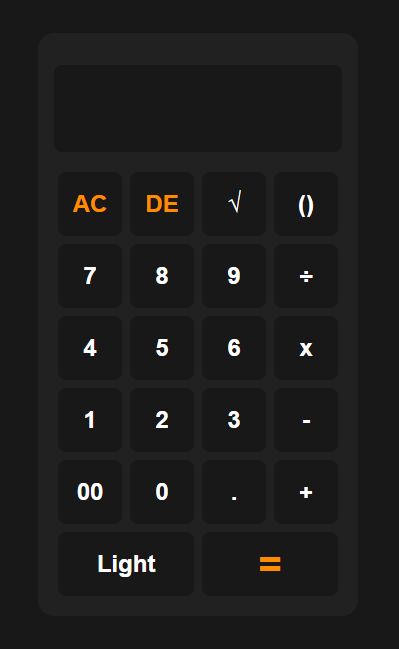

# 🥮 Calculator

A modern, responsive calculator built with **HTML**, **CSS**, and **JavaScript**.
It supports basic arithmetic, square roots, parentheses, and includes dark/light mode toggling — all wrapped in a clean and user-friendly interface.

---

## 📸 Preview

> *(Add a screenshot named `preview.png` in the repo to show here)*
> 

---

## ✨ Features

* ✅ **Basic Operations** — Addition, Subtraction, Multiplication, Division, Decimal, Double Zero
* 🧮 **Square Root Support** — `√` function with `Math.sqrt()`
* ⭯️ **Clear & Delete** — "AC" to clear display, "DE" to delete last character
* 🧠 **Smart Bracket Insertion** — Auto-detects whether to insert `(` or `)`
* 🌗 **Dark / Light Mode** — Toggle theme with a button
* 🔒 **Read-Only Input** — Prevents direct editing to avoid expression issues
* ⚠️ **Error Handling** — Catches and displays friendly syntax/math error messages

---

## 🛠️ Tech Stack

* **HTML5**
* **CSS3** (with CSS variables for themes)
* **Vanilla JavaScript**

---

## 📂 Project Structure

```
Calculator.html/
├── index.html     # Main HTML structure
├── style.css      # Styling and themes
├── script.js      # All calculator logic
└── README.md      # Project documentation
```

---

## 💡 How to Use

1. **Clone the repository:**

   ```bash
   git clone https://github.com/your-username/Calculator.html.git
   cd Calculator.html
   ```

2. **Open `index.html` in any modern browser.**

> No build tools or dependencies are needed — it works instantly!

---

## 📌 Notes

* This calculator uses JavaScript's `eval()` for simplicity.
  ⚠️ *Avoid entering any unsafe expressions.*

---

## 📃 License

This project is open-source and available under the [MIT License](LICENSE).

---

## 👨‍💻 Author

**Mian Dawood bin Rafay**
📍 *Bahawalpur, Pakistan*
🎓 *BS Software Engineering @ FAST University (CFD Campus)*
📧 *\[Optional: Add your email here]*
🌐 GitHub: [Mian Dawood bin Rafay](https://github.com/your-username)

---

> Feel free to fork this project, customize it, and share your version!
